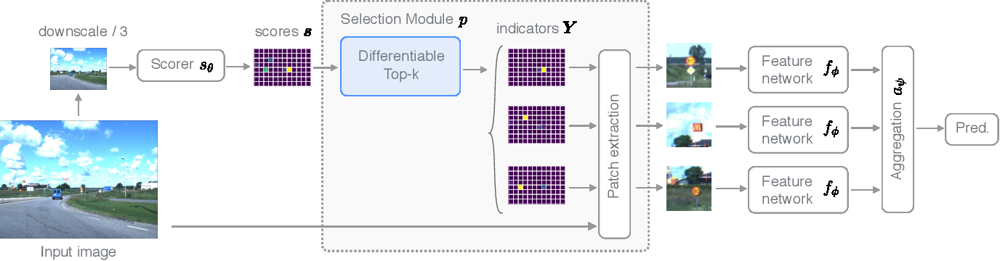

# PyTorch implementation of Differentiable Patch Selection

Implementation of DPS from the paper [Differentiable patch selection for image recognition](https://openaccess.thecvf.com/content/CVPR2021/html/Cordonnier_Differentiable_Patch_Selection_for_Image_Recognition_CVPR_2021_paper.html) applied to traffic sign recognition.

## Usage
Run `main.py` to train a model.
All configs can set in this file as well.

## Further notes

This implementation was used as baseline in [Iterative Patch Selection for High-Resolution Image Recognition](https://arxiv.org/abs/2210.13007) and uses a simplified pre-trained ResNet as scorer network, as well as a pre-trained ResNet-18 as feature network. For patch aggregation, a cross-attention transformer module is used.

Hyperparameter details can be found the appendix.

## Citations
```bibtex
@inproceedings{cordonnier2021differentiable,
  title={Differentiable patch selection for image recognition},
  author={Cordonnier, Jean-Baptiste and Mahendran, Aravindh and Dosovitskiy, Alexey and Weissenborn, Dirk and Uszkoreit, Jakob and Unterthiner, Thomas},
  booktitle={Proceedings of the IEEE/CVF Conference on Computer Vision and Pattern Recognition},
  pages={2351--2360},
  year={2021}
}
```

```bibtex
@article{bergner2022iterative,
  title={Iterative Patch Selection for High-Resolution Image Recognition},
  author={Bergner, Benjamin and Lippert, Christoph and Mahendran, Aravindh},
  journal={arXiv preprint arXiv:2210.13007},
  year={2022}
}
```
